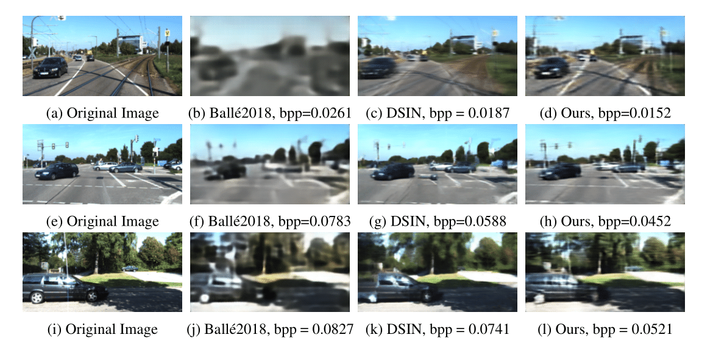
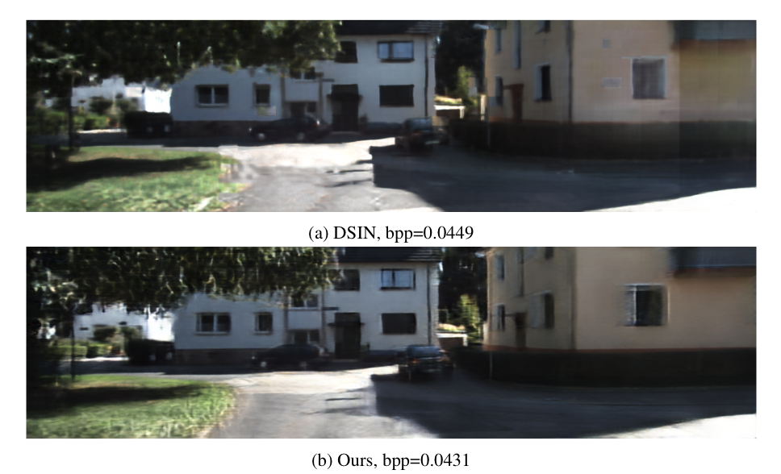
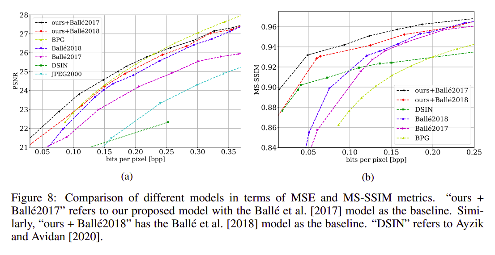

### Neural Distributed Image Compression using Common Information (NDIC) [[Paper]](https://arxiv.org/abs/2106.11723)



 

"Ballé2018" and "DSIN" refer to [Variational image compression with a scale hyperprior](https://arxiv.org/abs/1802.01436), [Deep Image Compression using Decoder Side Information](https://arxiv.org/abs/2001.04753), respectively. "Ours" refers to our proposed model using "Ballé2017" model, which refers to [End-to-end Optimized Image Compression](https://arxiv.org/abs/1611.01704), as the baseline.


## Citation
``` bash
@misc{NDIC,
      title={Neural Distributed Image Compression using Common Information}, 
      author={Nitish Mital and Ezgi Ozyilkan and Ali Garjani and Deniz Gunduz},
      year={2021},
      eprint={2106.11723},
      archivePrefix={arXiv},
      primaryClass={eess.IV}
}
```

## Abstract
We present a novel deep neural network (DNN) architecture for compressing an image when a correlated image is available as side information only at the decoder. This problem is known as distributed source coding (DSC) in information theory. In particular, we consider a pair of stereo images, which generally have high correlation with each other due to overlapping fields of view, and assume that one image of the pair is to be compressed and transmitted, while the other image is available only at the decoder. In the proposed architecture, the encoder maps the input image to a latent space, quantizes the latent representation, and compresses it using entropy coding. The decoder is trained to extract the common information between the input image and the correlated image, using only the latter. The received latent representation and the locally generated common information are passed through a decoder network to obtain an enhanced reconstruction of the input image. The common information provides a succinct representation of the relevant information at the receiver. We train and demonstrate the effectiveness of the proposed approach on the KITTI and Cityscape datasets of stereo image pairs. Our results show that the proposed architecture is capable of exploiting the decoder-only side information, and outperforms previous work on stereo image compression with decoder side information.

## Usage
### Clone
Clone this repository and enter the directory using the commands below:
```bash
git clone https://github.com/ipc-lab/NDIC.git
cd NDIC/
```

### Requirements
`Python 3.7.3` is recommended.

Install the required packages with:
```bash
pip install -r requirements.txt
```
If you're having issues with installing PyTorch compatible with your CUDA version, we strongly suggest you refer to [related documentation page](https://pytorch.org/get-started/previous-versions/).

### Dataset
The datasets used for experiments are KITTI Stereo and Cityscape.

For KITTI Stereo you can download the necessary image pairs from [KITTI 2012](http://www.cvlibs.net/download.php?file=data_stereo_flow_multiview.zip) and [KITTI 2015](http://www.cvlibs.net/download.php?file=data_scene_flow_multiview.zip). After obtaining `data_stereo_flow_multiview.zip` and `data_scene_flow_multiview.zip`, run the following commands:
```bash
unzip data_stereo_flow_multiview.zip # KITTI 2012
mkdir data_stereo_flow_multiview
mv training data_stereo_flow_multiview
mv testing data_stereo_flow_multiview

unzip data_scene_flow_multiview.zip # KITTI 2015
mkdir data_scene_flow_multiview
mv training data_scene_flow_multiview
mv testing data_scene_flow_multiview
```

For Cityscape you can download the image pairs from [here](https://www.cityscapes-dataset.com/downloads/). After downloading `leftImg8bit_trainvaltest.zip` and `rightImg8bit_trainvaltest.zip`, run the following commands:
```bash
mkdir cityscape_dataset
unzip leftImg8bit_trainvaltest.zip
mv leftImg8bit cityscape_dataset
unzip rightImg8bit_trainvaltest.zip
mv rightImg8bit cityscape_dataset
```

### Weights
Pre-trained models on the datasets mentioned in the paper for "Ballé2017", "Ballé2018", "Ours + Ballé2017" and "Ours + Ballé2018" models, trained either wrt. MSE or MS-SSIM reconstruction loss, can be downloaded from this [link](https://drive.google.com/drive/folders/13Lk9DB3SeKutneQbYP_d5nXCa5DoRs4R?usp=sharing).

If desired, download the desired weights and put them in `pretrained_weights` folder and update the `configs/config.yaml` parameters accordingly. 

### Getting Started
To use the code, please run:
```bash
python main.py
```
Please be aware that the initial console output (including the ongoing test results) might take a while to be printed. 

By default, this code uses the configurations in `configs/config.yaml`. You can either change this configuration file or create a new `yaml` file and use that for running. For this case, please run:
```bash
python main.py --config=path/to/new/config/file
```
You can also use `Custom Configuration Notebook.ipynb` notebook to create your custom configuration and run the model based on that.
### Configurations

- Dataset:
```yaml
dataset_name: 'KITTI' # the name of the dataset. it can be either KITTI or Cityscape
dataset_path: '.' # for KITTI it's the txt files containing the real path of the images, and for Cityscape it's the path
                  # to the directory that contains leftImg8bit and rightImg8bit folders
resize: [128, 256]
```

`dataset_name` is the name of the dataset which will be used in the model. In case of using KITTI, `dataset_path` shows the path to `data_paths` directory that contains every image and its pair path, and for Cityscape it is the path to the directory that contains `leftImg8bit` and `rightImg8bit` folders. The `resize` value selects the width, and the height dimensions that each image will be resized to.

- Model:
```yaml
baseline_model: 'bls17' # can be bmshj18 for Variational image compression with a scale hyperprior by Ballé, et al.
                          # or bls17 for End-to-end Optimized Image Compression by Ballé, et al.
use_side_info: True # if True then the modified version of baseline model for distributed compression is used.
num_filters: 192 # number of filters used in the baseline model network
cuda: True
load_weight: False
weight_path: './pretrained_weights/ours+balle17_MS-SSIM_lambda3e-05.pt' # weight path for loading the weight
# note that we provide some pretrained weights, accessible from the link provided in README.md, under the title "Weights"
```

`baseline_model` selects the compression model. The accepted models for this parameter are `'bmshj18'` for [Variational image compression with a scale hyperprior](https://arxiv.org/abs/1802.01436) and `'bls17'` for [End-to-end Optimized Image Compression](https://arxiv.org/abs/1611.01704). If `use_side_info` is set as `True`, then the baseline model is modified using our proposed method for using side information for compressing.
If `load_weight` is `True`, then in model initialization, the weight saved in `weight_path` is loaded to the model.


- Training
```yaml
train: True
epochs: 50000
train_batch_size: 1
lr: 0.0001
lambda: 0.00003 # the lambda value in rate-distortion equation
alpha: 1
beta: 1
distortion_loss: 'MS-SSIM' # can be MS-SSIM or MSE. selects the method by which the distortion is calculated during training
verbose_period: 50 # non-positive value indicates no verbose
```

For training set `train` to be `True`. `lambda` shows the lambda value in the rate-distortion equation and `alpha` and `beta` correspond to the handles on the reconstruction of the correlated image and amount of common information extracted from the decoder-only side information, respectively. `distortion_loss` selects the distortion evaluating method. Its accepted values are MS-SSIM for the ms-ssim method or MSE for mean squared error.
`verbose_period: 50` indicates that every 50 epochs print the results of the validation dataset.

- Weight parameters
```yaml
save_weights: True
save_output_path: './outputs' # path where results and weights will be saved
experiment_name: 'bls17_with_side_info_MS-SSIM_lambda:3e-05'
```

If you wish to save the model weights after training, set `save_weights` `True`. `save_output_path` shows the directory path where the model weights are saved.
For the weights, in `save_output_path` a `weight` folder will be created, and the weights will be saved there with the name according to `experiment_name`. 

- Test:
```yaml
test: True
save_image: True
experiment_name: 'bls17_with_side_info_lambda:0.1'
```

If you wish to test the model and save the results set `test` to `True`. If `save_image` is set to `True` then a `results` folder will be created, and the reconstructed images will be saved in `save_output_path/results` during testing, with the results named according to `experiment_name`.


### Inference 

In order to (only) carry out inference, please open `configs/config.yaml` and change the relevant lines as follows:

```yaml
resize: [128, 256] # we used this crop size for our inference
dataset_path: '.'
train: False
load_weight: True
test: True
save_output_path: './inference' 
save_image: True 
```
Download the desired weights and put them in `pretrained_weights` folder and put the dataset folder in the root . 

Based on the weight you chose, specify the weight name in `configs/config.yaml`:

```yaml
weight_path: './pretrained_weights/...'  # load a specified pre-trained weight
experiment_name: '...' # a handle for the saved results of the inference
```

Also, change `baseline_model` and `use_side_info` parameters in `configs/config.yaml` accordingly.
For example, for the `ours+balle2017` weights, these parameters should be: 

```yaml
baseline_model: 'bls17'
use_side_info: True
```

After running the code using the command below, the results will be saved in `inference` folder.
```bash
python main.py
```


### Results on datasets

 

In figure above, we used `MSE` and `MS-SSIM` distortion functions for training the models, respectively. The values of the parameter lambda for the DNN models, and the values of the quality parameter for BPG, used to obtain the plotted points are given in `Results.md`.


### License
This project is licensed under the MIT License. See the [LICENSE](LICENSE) file for more details.


### Authors/Contributors

* Ezgi Ozyilkan* (github: [ezgimez](https://github.com/ezgimez))
* Ali Garjani* (github: [garjania](https://github.com/garjania))
* Nitish Mital* (github: [nitishmital](https://github.com/nitishmital))
* Deniz Gunduz (github: [dgunduz](https://github.com/dgunduz))

*These authors contributed equally to this work.
