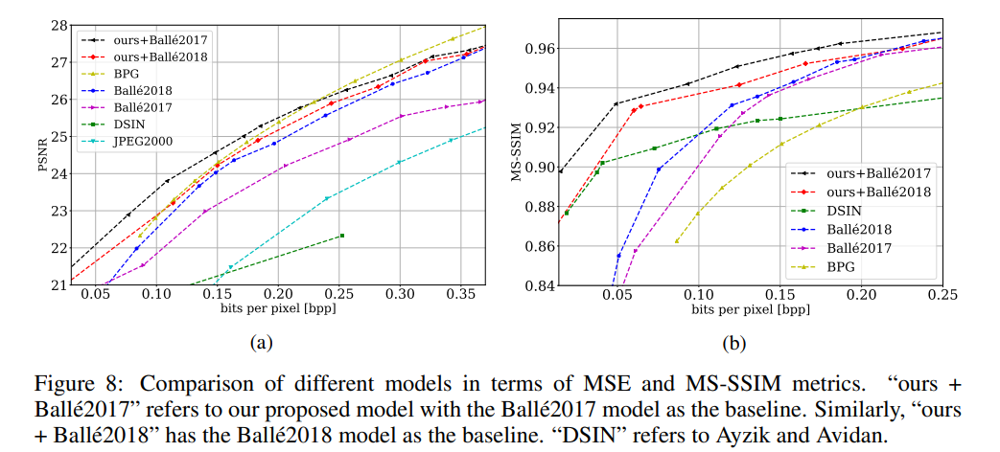

### Results

Date: June 2, 2021.

Here, we give more explanation about the parameters that we used for our plots in Figure 8. (a) and (b) in the main paper.

 

In Figure 8. (a) and (b), we used `MSE` and `MS-SSIM` distortion functions for neural network-based model trainings, respectively.

For Balle-extended models, we scale both distortion functions by a factor of (255**2) in order to avoid choosing very small lambda values to operate in the range of 0-0.3 BPP region.

Note that we used `window_size=7` in `MS-SSIM` distortion function as our training image size is of dimension 128x256.

We use the following lambda values to obtain both Figure 8. (a) and (b):
- `ours+Ballé2017`:
    - For `MSE`trainings: [2e-05, 4e-05, 0.0002, 0.0005, 0.0008, 0.0012, 0.0014, 0.0016, 0.002, 0.0026, 0.0032, 0.0038, 0.0044, 0.005, 0.0056]
    - For `MS-SSIM` trainings: [1.2e-05, 3e-05, 4.5e-05, 6e-05, 8e-05, 9e-05, 0.0001, 0.00014, 0.0002, 0.0008, 0.0014, 0.005]
- `ours+Ballé2018`:
    - For `MSE` trainings: [0.0002, 0.0008, 0.0011, 0.0014, 0.002, 0.0026, 0.0032, 0.0038, 0.0044, 0.0048]
    - For `MS-SSIM` trainings: [1.2e-05, 1.6e-05, 3e-05, 4.5e-05, 6e-05, 0.0001, 0.00014, 0.00018, 0.0022]
- `Ballé2018`:
    - For `MSE` trainings: [0.0002, 0.0005, 0.0009, 0.001, 0.0011, 0.0014, 0.002, 0.0026, 0.0032, 0.0038, 0.0044, 0.0048]
    - For `MS-SSIM` trainings: [1.6e-05, 8e-05, 4e-06, 8e-06, 1.2e-05, 2e-05, 3e-05, 4.5e-05, 6e-05, 7e-05, 9e-05, 0.0001, 0.00014, 0.00018, 0.00022, 0.00026]
- `Ballé2017`:
    - For `MSE` trainings: [0.0002, 0.0004, 0.0008, 0.0014, 0.002, 0.0026, 0.0032, 0.0036, 0.0044, 0.0048]
    - For `MS-SSIM` trainings: [4e-06, 1.2e-05, 3e-05, 3.7e-05, 4.5e-05, 6e-05, 9e-05, 0.00012, 0.00014, 0.00016, 0.00018]

Note that not all lambda values indicated above are shown in Figure 8. (a) and (b).

To carry out `JPEG 2000` and `BPG` evalutions, we used [`CompressAI`](https://github.com/InterDigitalInc/CompressAI) library. We varied the quality metric, `-q`, in the following ranges for `BPG` and `JPEG 2000`:
- For `BPG`: [10, 11, 12, ... 51]
- For `JPEG 2000`: [20, 25, 30, 35, 40, 50, 75, 100, 125, ... 250]
